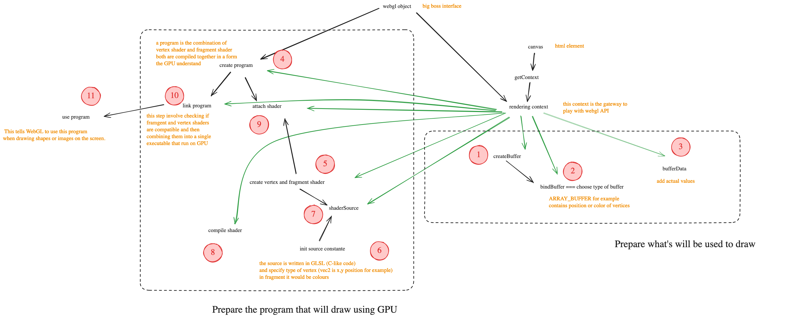

# WebGL-Fundamentals

This repository contains a simple project aimed at learning the basics of WebGL.

## Getting Started

To run this project locally, run the following command:

```bash
bun run dev
```

This command concurrently runs the TypeScript compiler in watch mode and starts the Bun server with hot reloading.
Open your browser and navigate to [http://localhost:3000](http://localhost:3000) to see the WebGL rendered squares.

